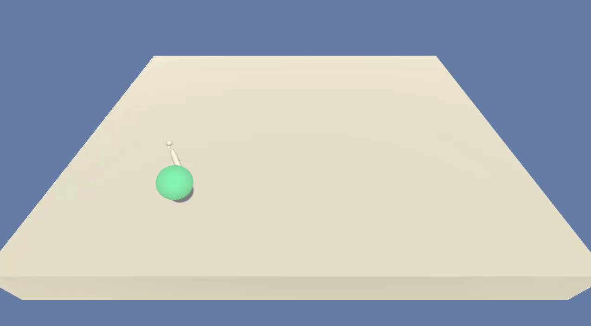

# Continuous Control

---
 ## Overview
 For this project we will teach our agent to control a double jointed arm to stay within/touching a moving target. A reward of +0.1 is privded for each step that the agent's had is in the goal location. The goal is to stay within the targets location for as many timesteps as possible.

 The observable space consists of 33 variables corresponding to position, rotaion, velocity and angular velocities of the arm. Each action is a vector with four numbers, corresponding to torque applicable to two joints. Every entery in the action vector should be a number between -1 and 1.

```
Unity Academy name: Academy
        Number of Brains: 1
        Number of External Brains : 1
        Lesson number : 0
        Reset Parameters :
		goal_speed -> 1.0
		goal_size -> 5.0
Unity brain name: ReacherBrain
        Number of Visual Observations (per agent): 0
        Vector Observation space type: continuous
        Vector Observation space size (per agent): 33
        Number of stacked Vector Observation: 1
        Vector Action space type: continuous
        Vector Action space size (per agent): 4
        Vector Action descriptions: , , , 
```

For this implementation we will be following an implementation of a Deep Deterministic Policy Gradients (DDPG) algorithm to train the agent using actor-critic methods to obtain an average score of +30 over 100 consecutive epoisodes. 



 ## Getting Started
 To interact with this project there are a series of dependencies which you must download and install prior to running the [Continuous_Control.ipynb](./Continuous_control.ipynb). Once you've installed the dependencies listed below, you can interact with the [Continuous Control Notebook](./Continuous_control.ipynb) which will contain several sections to describing the environment, training the agent, and then playing the trained agent in real time. 

 ### Dependencies
 In order to run the project you will need several things installed:
 * Python 3+
 * PyTorch
 * A DRNLD Configured environment [Instructions here](https://github.com/udacity/deep-reinforcement-learning#dependencies)
 * A way to run Jupiter Notebook like VSCode
 * A Unity Environment 
   * Linux: [click here](https://s3-us-west-1.amazonaws.com/udacity-drlnd/P2/Reacher/one_agent/Reacher_Linux.zip)
   * Mac OSX: [click here](https://s3-us-west-1.amazonaws.com/udacity-drlnd/P2/Reacher/one_agent/Reacher.app.zip)
   * Windows (32-bit): [click here](https://s3-us-west-1.amazonaws.com/udacity-drlnd/P2/Reacher/one_agent/Reacher_Windows_x86.zip)
   * Windows (64-bit): [click here](https://s3-us-west-1.amazonaws.com/udacity-drlnd/P2/Reacher/one_agent/Reacher_Windows_x86_64.zip)

 Once you've downloaded the Environment, extract the contents in the root of the project (Example)
  * ./ContinuousControl/Reacher_Data/
  * ./ContinuousControl/unityPlayer.dll
  * ./Reacher.exe
  
 #### Running the agent
 Once you've download all of the necessary dependencies, open the `Continuous_Control.ipynb` file and follow the embedded instructions within.

### Details

See the description in the [Report.md](./Report.md)