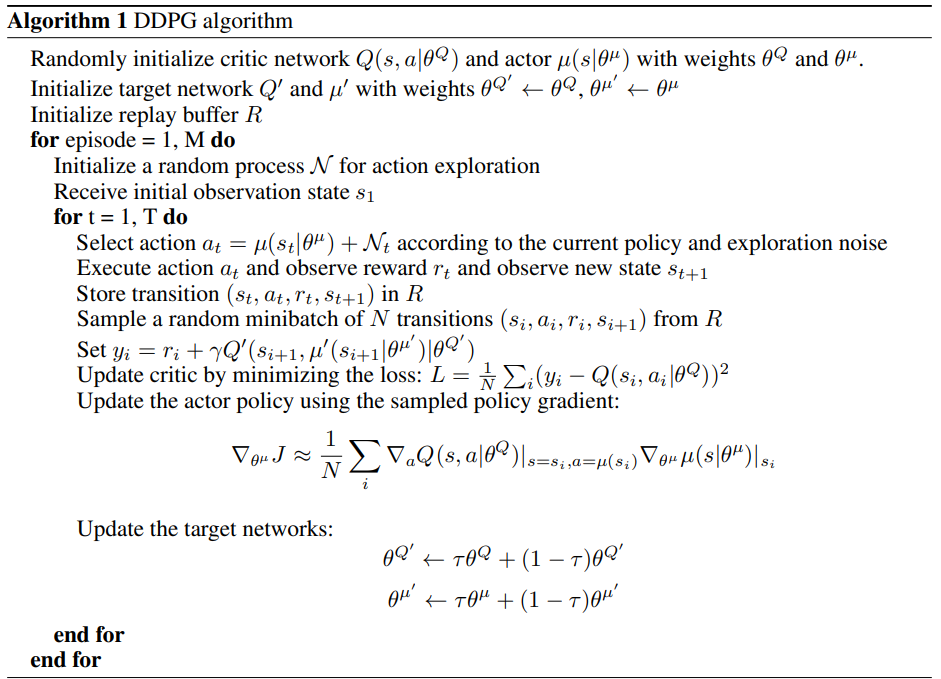
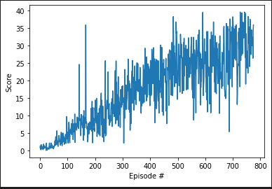

# Continuous Control Project Report

For instructions to run see [README.md](./README.md)

## Implementation Details

The Project consists of the following files:

    - Agent.py                  -- Implementation of a Deep Deterministic Policy Gradient (DDPG) Agent
    - Actor.py                  -- Actor (Policy) model used by the agent
    - checkpoint_actor.pth      -- Trained actor model weights
    - checkpoint_critic.pth     -- Trained critic model weights
    - ContinuousControl.ipynb   -- Jupyter notebook used to train the DDPG Agent  
    - Critic.py                 -- Critic (Value) model used by the agent 
    - Noise.py                  -- An implementation of an Ornstein-Uhlenbeck process to add noise to the training
    - ReplayBuffer.py           -- Double ended queue with random sampling methods to store the learning experiences

### Learning Algorithm and Neural Network

For this project we used an actor-critc approach based on the Deterministc Policy Gradient algorithm. Based on the [Deep Deterministic Policy Gradient conference paper](https://arxiv.org/pdf/1509.02971.pdf)(*Lillicrap, 2015*).

The Agent implments an actor-critc method; meaning an actor model for the target policy and a critic model for learning. The Agent uses a Ornstein-Uhlenbeck process for adding noise to the exploration due to the efficiency in physical control problems with inertia. (*Wawrzynski, 2015*). It also utilzies a ReplayBuffer to store the environment experiences so we can apply learning steps in mini-batches instead of continuous updates to prevent correlation between sequence tuples and potentially diverging from the optimal policy. All learning steps are applied using a soft update procedure which is used to slowly blend the regular network weights with the target network. 

The [actor model](./Actor.py) is the current policy for deterministic state-action mappings. It consists of three fully connected layers, where the first layer is the state size to 400 units, the second layer is a mapping of 400 units to 300 units, and the third connected layer was 300 units to the action_size. The three layers were initalized with a uniform distrubtion of 400 (fc1), 300 (fc2) and [-3x10-3, 3x10-3] (fc3) respectivly. The neural network used the rectified non-linearity (relu) for both FC1 and FC2 and the final layer (FC3) used a tanh function to bound the actions. 

The [critic model](./Critic.py) is used evalutate the optimal state-action policy using a Q-learning equation, implmented in the Agent. The critic model used four layers and also used *batched normalization* (Ioffe & Szegedy, 2015) to normalize each dimension across samples in the minibatch, this is due to the environment having mutliple physical units (such as position, torque and velocity). The network consists of four fully connected layers, where the first layer was the state_size to 400 units, the second layer was 400 units + action_size to 300 units, the third layer was 300 units to 300 units and the final layer was 300 units to 1 unit. The four layers were initalized with a uniform distrubtion of 400 (fc1), 300 (fc2). 300 (fc3) and [-3x10-3, 3x10-3] (fc4) respectivly. The neural network used the rectified non-linearity (relu) for FC1, FC2 and FC3 layers, it also concatenated the seqences and actions of the first layer to a single dimension. 

For learning the pseudo code was as follows (*Lillicrap, 2015*):

The implementation of the pesudo code in the [Continuous_Control.ipynb](./Continuous_Control.ipynb) starts by initializing the agent. The agent then intializes the actor and critic networks as defined above. We then set up a iterative loop of a maximum of 5000 episodes and initialize a deque of 100 samples (The solved condition is if the mean of the last 100 episodes were greater than 30). For each episode it will reset the environment, obtain the initial state and begin interacting for with the Reacher environment. 

For every timestep t, the agent gets the associated action given the state, applying noise to each action while it is learning. It then takes the given action and applies it to the environment, retrieving the next states, actions values and if the environment is done. It then applies the step to the agent for performing the soft updates. First it updates the replay buffer with the experience and then if the number of runs matches the batch update, it will pull a random sampling from the replay buffer, apply the actions, states to the actor and critic networks and then apply experience as a soft update to both models. 

If the environment is solved then it will exit the loop and save the target actor and critic models and plot the rewards over time.

### Hyper Parameters
|Parameter| Value|
--- | --- |
Epsilon start | 1.0 |
Epsilon Discount Factor | 0.99 |
Noise Discount Factor | 1e-6 |
Soft Update Rate Actor | 1e-4 |
Soft Update Rate Critic | 1e-3 |
Learning Rate | 5e-4 |
Batch Learning Size | 4 |
Interpolation param (τ) | 1e-3 |

### ReplayBuffer Hyper Parameters
|Parameter| Value|
--- | --- |
Replay buffer size | 1e6 |
Batch size | 64 |

### Noise Hyper Parameters
|Parameter| Value|
--- | --- |
θ | 0.15 |
σ | 0.2 |

## Plot
 The figure below is the plot of the rewards over runs during the training episodes

> * [Episode 100]	Average Score (Last 100 episodes): 2.0
> * [Episode 200]	Average Score (Last 100 episodes): 7.5
> * [Episode 300]	Average Score (Last 100 episodes): 11.4
> * [Episode 400]	Average Score (Last 100 episodes): 17.5
> * [Episode 500]	Average Score (Last 100 episodes): 22.0
> * [Episode 600]	Average Score (Last 100 episodes): 24.5
> * [Episode 700]	Average Score (Last 100 episodes): 24.9
> * [Episode 776]	Average Score (Last 100 episodes): 30.1
> * Solved in 775 episodes!	Average Score (Last 100 episodes)=30.1
 
## Future work

Future improvements could be made to start by implementing the optional version that can solve the 20 agent version of the proejct instead of the single agent approach.

There were several other algorithms discussed in the chapters for this project and setting up several agents to run implementing different algorithms such as proximal policy optimization (PPO) or Asynchronous advantage actor-critic (A3C) could be implemented to compare learning rates. 

We could also expand and improve our DDPG algorithm by implementing a Distributed Distributional Deep Deterministic Policy Gradient algorithm (D4PG) to further increase the performance of learning. Finally, further tuning of the hyper parameters could be done as well, as I didn't have access to a GPU for a lot of the training sessions, I relied on my CPU for training runs and it was very time consuming to fine tune the learning algorithm. 

## References

Wawrzynski, Paweł. Control policy with autocorrelated noise in reinforcement learning for robotics.
International Journal of Machine Learning and Computing, 5:91–95, 2015.

Continuous Control With Deep Reinforcement Learning. Lillicrap, Hunt, Pritzel, Heess, Erez, Tassa, Silver, and Wierstra. eprint arXiv, 2015

Ioffe, Sergey and Szegedy, Christian. Batch normalization: Accelerating deep network training by
reducing internal covariate shift. arXiv preprint arXiv:1502.03167, 2015.